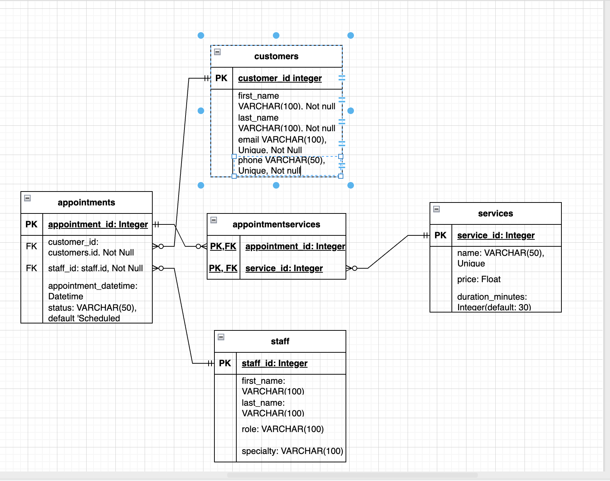

# Barbershop Web Server API

## Project Description
This project is an API for a barbershop appointment booking system. It enables management of customers, staff, appointments, and services. The API supports CRUD operations, robust validation, error handling, and is designed with scalability and maintainability in mind.

## ERD & Database Design
- **Entities:**
  - **Customer**: Stores client information.
  - **Staff**: Stores details of barbers/stylists.
  - **Service**: Represents available services (e.g., haircut, shave).
  - **Appointment**: Represents bookings, linking customers, staff, and services.
  - **AppointmentServices**: Junction table for many-to-many relation between appointments and services.
- **ERD Overview:**
  - A Customer can have many Appointments.
  - Staff can be assigned to many Appointments.
  - Each Appointment can have multiple Services (via AppointmentServices).
  - Each Service can be part of many Appointments.

## ERD Diagram


## CRUD Functionality
- **Customers**: Create, read, update, delete customers.
- **Staff**: Full CRUD for staff members.
- **Services**: Manage service types.
- **Appointments**: Book, view, update, and cancel appointments.
- **AppointmentServices**: Add/remove services for a specific appointment.

## Validation & Error Handling
- All input data is validated for required fields, types, and value constraints.
- Custom error messages are returned for invalid data, missing resources, and business logic errors (e.g., double-booking staff).
- The API returns consistent JSON error responses with status codes (e.g., 400, 404, 409).

## Peer Feedback & Actions Taken
- **Feedback from Aamod (Teacher, Planning Stage):**
  - Initial ERD design incorrectly modeled the relationship between `appointments` and `services` as many-to-many directly.  
  - **Action Taken:** Adjusted the ERD to introduce `appointment_services` as a proper junction table, changing the relationships to one-to-many from both `appointments` and `services` into `appointment_services`. This ensured correct normalization and alignment with database design best practices.

- **Feedback from Friend (Barber, Development Stage):**
  - Requested that appointments should be visible when viewing customer or staff details, to better reflect real-world usage.  
  - **Action Taken:** Added nested relationships in the schemas so that appointment data is included when retrieving customer or staff details. This improved usability and made the API more practical for real barbershop workflows.

## Database System Choice (PostgreSQL vs MongoDB)
- **PostgreSQL:** Used for production deployments because it enforces structured schemas, foreign key constraints, and ACID-compliant transactions.
- **Rationale:** PostgreSQL is ideal for this barbershop project, where appointments, customers, staff, and services have complex relationships. It ensures data integrity, prevents double-bookings, and allows efficient relational queries and joins. Unlike NoSQL databases such as MongoDB, PostgreSQL provides robust schema enforcement and transactional safety. It integrates seamlessly with Flask and SQLAlchemy, supports migrations, and delivers consistent performance for both development and production.

## Deployment Instructions
1. **Clone the repository** and navigate to the project directory.
2. **Create a virtual environment**
3. **Install dependencies:**
   ```
   pip install -r requirements.txt
   ```
4. **Create a `.env` file** with the necessary environment variables (see `.env.example` for reference).
5. **Create a `.flaskenv` file** and add:
   ```
   FLASK_APP=main
   ```

6. **Start the server:**
   ```
   flask run
   ```

## Deployment
Online deployment takes place in the following link:
https://barbershop-web-server-api.onrender.com
