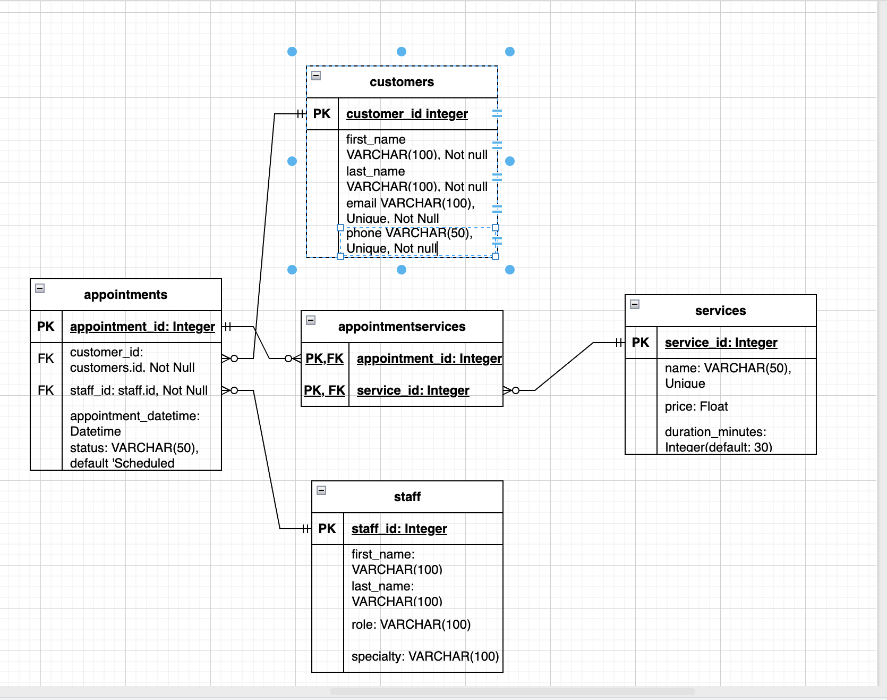

# Barbershop Web Server API

## Project Description
This project is an API for a barbershop appointment booking system. It enables management of customers, staff, appointments, and services. The API supports CRUD operations, robust validation, error handling, and is designed with scalability and maintainability in mind.

## ERD & Database Design
- **Entities:**
  - **Customer**: Stores client information.
  - **Staff**: Stores details of barbers/stylists.
  - **Service**: Represents available services (e.g., haircut, shave).
  - **Appointment**: Represents bookings, linking customers, staff, and services.
  - **AppointmentServices**: Junction table for many-to-many relation between appointments and services.
- **ERD Overview:**
  - A Customer can have many Appointments.
  - Staff can be assigned to many Appointments.
  - Each Appointment can have multiple Services (via AppointmentServices).
  - Each Service can be part of many Appointments.

## ERD Diagram


## CRUD Functionality
- **Customers**: Create, read, update, delete customers.
- **Staff**: Full CRUD for staff members.
- **Services**: Manage service types.
- **Appointments**: Book, view, update, and cancel appointments.
- **AppointmentServices**: Add/remove services for a specific appointment.

## Validation & Error Handling
- All input data is validated for required fields, types, and value constraints.
- Custom error messages are returned for invalid data, missing resources, and business logic errors (e.g., double-booking staff).
- The API returns consistent JSON error responses with status codes (e.g., 400, 404, 409).

## Peer Feedback & Actions Taken
- **Feedback from Aamod (Teacher, Planning Stage):**
  - Initial ERD design incorrectly modeled the relationship between `appointments` and `services` as many-to-many directly.  
  - **Action Taken:** Adjusted the ERD to introduce `appointment_services` as a proper junction table, changing the relationships to one-to-many from both `appointments` and `services` into `appointment_services`. This ensured correct normalization and alignment with database design best practices.

- **Feedback from Friend (Barber, Development Stage):**
  - Requested that appointments should be visible when viewing customer or staff details, to better reflect real-world usage.  
  - **Action Taken:** Added nested relationships in the schemas so that appointment data is included when retrieving customer or staff details. This improved usability and made the API more practical for real barbershop workflows.

## Database System Choice (PostgreSQL vs MongoDB)
- **PostgreSQL:** Used for production deployments because it enforces structured schemas, foreign key constraints, and ACID-compliant transactions.
- **Rationale:** PostgreSQL is ideal for this barbershop project, where appointments, customers, staff, and services have complex relationships. It ensures data integrity, prevents double-bookings, and allows efficient relational queries and joins. Unlike NoSQL databases such as MongoDB, PostgreSQL provides robust schema enforcement and transactional safety. It integrates seamlessly with Flask and SQLAlchemy, supports migrations, and delivers consistent performance for both development and production.

## Deployment Instructions
1. **Clone the repository** and navigate to the project directory.
2. **Create a virtual environment**
3. **Install dependencies:**
   ```
   pip install -r requirements.txt
   ```
4. **Create a `.env` file** with the necessary environment variables (see `.env.example` for reference).
5. **Create a `.flaskenv` file** and add:
   ```
   FLASK_APP=main
   ```

6. **Start the server:**
   ```
   flask run
   ```

## Deployment
Online deployment previously took place in the following link:
https://barbershop-web-server-api.onrender.com


---

# 🚀 CI/CD Pipeline & Cloud Deployment

## Overview

This project now uses a complete Continuous Integration and Continuous Deployment (CI/CD) pipeline to automate testing, packaging, and deployment of the Barbershop Web Server API. The application itself is a Flask-based backend API that manages customers, staff, services, and appointments. The CI/CD pipeline is responsible for ensuring that the code is validated before release, transformed into a portable container image, stored in a secure image registry, and then deployed to a live cloud environment with a managed PostgreSQL database.

The purpose of this automation is not only to reduce repetitive manual work, but also to improve software quality, deployment reliability, traceability, and consistency across environments. In a real software engineering team, this kind of pipeline allows developers to focus more on feature development and problem solving while the pipeline handles repetitive validation and release tasks automatically.

---

## CI/CD Architecture Diagram

The overall architecture of the application and its CI/CD pipeline can be represented as follows:

```text
Developer
   ↓
GitHub Repository
   ↓
GitHub Actions CI Workflow
   ↓
Automated Tests (pytest)
   ↓
Docker Image Build
   ↓
Google Artifact Registry
   ↓
GitHub Actions CD Workflow
   ↓
Google Cloud Run
   ↓
Google Cloud SQL (PostgreSQL)
```

📸 Insert Screenshot Here: Draw.io architecture diagram showing the full CI/CD flow from GitHub to Cloud Run and Cloud SQL

This diagram shows that the pipeline begins when a developer pushes code to GitHub. GitHub Actions then runs the Continuous Integration workflow, which executes automated tests. If those tests pass, the Continuous Deployment workflow builds a Docker image, pushes it to Artifact Registry, and deploys it to Cloud Run. The deployed application then communicates with Cloud SQL for persistent data storage.

---

## Explanation of the Automation Workflow

### Continuous Integration Workflow

The Continuous Integration workflow is defined in `.github/workflows/test.yml`. Its main purpose is to automatically validate code changes before they are merged or deployed. This helps catch problems early, prevents regressions, and increases confidence that the application is working correctly.

The workflow is triggered by three events: a push to the main branch, a pull request targeting main, and a manual trigger using `workflow_dispatch`. These triggers demonstrate that the workflow is flexible enough to support both normal development and controlled manual execution. In practice, the pull request trigger is especially important because it provides automated quality checks before code is merged, while the push trigger ensures that the main branch remains stable.

The CI workflow performs several steps in sequence:

The CI workflow performs several steps in sequence. First, it checks out the repository code so the workflow runner has access to the latest project state. Next, it installs Python 3.13 using the official GitHub Actions setup action. After that, it installs all project dependencies from requirements.txt. Once the environment has been prepared, the workflow executes the automated test suite using pytest > test-results.txt. This command is important because it not only runs the tests but also redirects the output into a custom log file. That log file is then uploaded as an artifact using the actions/upload-artifact action, which means the results remain available after the workflow finishes. Finally, the log file is printed directly in the workflow output for immediate visibility.

A simplified representation of the CI workflow is shown below:

```text
Push / Pull Request / Manual Trigger
   ↓
Checkout Code
   ↓
Set Up Python
   ↓
Install Dependencies
   ↓
Run pytest
   ↓
Generate test-results.txt
   ↓
Upload Artifact
   ↓
Show Logs in GitHub Actions
```

### CI workflow success
 
**Continuous Integration Workflow Execution**

This screenshot shows the successful execution of the CI workflow in GitHub Actions. The workflow is triggered automatically on push and pull request events and performs a sequence of steps including checking out the repository, setting up the Python environment, installing dependencies, and executing automated tests using pytest. The successful completion of this workflow demonstrates that the application code has passed all validation checks in a clean, reproducible environment, ensuring reliability before deployment.
### Artifact upload

**Uploaded Test Artifact**

This screenshot shows the test-results artifact generated by the CI workflow. The workflow captures the output of pytest and stores it as a downloadable file, ensuring that test results are preserved beyond the runtime of the workflow. This improves traceability and allows developers to review logs for debugging or auditing purposes, which is a key requirement in professional CI/CD pipelines.

This workflow satisfies several important automation goals. It verifies that the application still functions correctly after code changes, it creates persistent logs for review, and it standardises testing so that the same validation happens every time. In industry, this reduces the risk of “it works on my machine” problems because every change is tested in a clean, reproducible environment.

---

### Continuous Deployment Workflow

The Continuous Deployment workflow is defined in .github/workflows/deploy.yml. Its purpose is to automatically package and deploy the application after the CI workflow has completed successfully. This creates a dependent workflow design, which is a more advanced and realistic CI/CD pattern because deployment is only allowed when testing has passed.

The Continuous Deployment workflow is triggered using `workflow_run`, ensuring deployment only occurs after successful CI validation. This enforces a gated deployment strategy, which is a best practice in production pipelines because it prevents untested or failing code from reaching production environments.

Each deployment is tagged with a commit SHA, enabling precise version control and traceability. This allows developers to roll back to previous stable versions using Cloud Run revisions if a deployment introduces issues. This level of traceability is critical in professional DevOps environments, where accountability and recovery from failure are essential.

The image is tagged with ${{ github.sha }}, which means each deployment is tied to a specific commit. This is important because it creates traceability and versioned deployments. If a problem is introduced, the team can identify exactly which code version was deployed. After the build step, the image is pushed to Google Artifact Registry. Once stored there, the workflow deploys the image to Google Cloud Run. During deployment, runtime configuration is applied, including the public accessibility flag, port configuration, memory allocation, and minimum and maximum instance settings. The workflow also injects the DATABASE_URI environment variable securely from GitHub Secrets so that the deployed service can connect to Cloud SQL.

A simplified representation of the CD workflow is shown below:

```text
Successful CI Workflow / Manual Trigger
   ↓
Authenticate to Google Cloud
   ↓
Configure Docker
   ↓
Build Docker Image
   ↓
Tag Image (commit SHA)
   ↓
Push Image
   ↓
Deploy to Cloud Run
   ↓
Inject Environment Variables
```

### CD workflow success

**Continuous Deployment Workflow Execution**

This screenshot shows the successful execution of the CD workflow. The workflow is triggered automatically after the CI workflow completes successfully using a dependent workflow pattern. It builds a Docker image, tags it with a commit SHA, pushes it to Artifact Registry, and deploys it to Cloud Run. This automation eliminates manual deployment steps and ensures consistent, repeatable releases.
### Cloud Run deployment

**Deployed Cloud Run Service**

This screenshot shows the deployed application running on Google Cloud Run. Cloud Run hosts the containerised Flask API in a serverless environment, automatically handling scaling, networking, and infrastructure management. The service URL provides a public endpoint for accessing the API.
### Revisions tab  

**Cloud Run Revision History**

This screenshot shows the revision history of the deployed service. Each deployment creates a new revision tied to a specific Docker image and commit SHA. This enables version control at the deployment level, allowing for easy rollback and traceability of production changes.

### ENV Variables (DATABASE_URI)

**Environment Variable Configuration**

This screenshot shows the DATABASE_URI environment variable configured in Cloud Run. This value is securely injected from GitHub Secrets during deployment, ensuring sensitive credentials are not stored in the codebase. This demonstrates secure configuration management, which is critical in modern cloud applications.

### Cloud SQL Database

**Cloud SQL PostgreSQL Instance**

This screenshot shows the Cloud SQL instance used for persistent data storage. Unlike in-memory or local databases, Cloud SQL provides a managed, production-ready PostgreSQL environment that maintains data across deployments and supports relational integrity, ensuring the application behaves consistently in a real-world scenario.

### CI/CD Architecture Diagram


This diagram represents the complete CI/CD pipeline and cloud architecture for the Barbershop API. It begins with a developer pushing code to GitHub, which triggers the Continuous Integration workflow in GitHub Actions. The CI pipeline installs dependencies, executes automated tests using pytest, and generates test logs as artifacts.

Once testing is successful, the Continuous Deployment workflow is triggered. This workflow builds a Docker image of the application, tags it using the commit SHA for version control, and pushes it to Google Artifact Registry. From there, the container image is deployed to Google Cloud Run, where the Flask API is hosted in a serverless environment.

The deployed application connects securely to a managed PostgreSQL database hosted on Google Cloud SQL using environment variables. This architecture ensures automated validation, consistent deployments, scalability, and persistent data storage.

---

## Services & Technologies

### Flask
The application itself is built with Flask, which is a lightweight Python web framework. Flask is responsible for handling HTTP requests, registering routes, returning JSON responses, and providing the overall application structure. In this project, Flask is used to expose CRUD endpoints for customers, staff, appointments, and services, while also supporting health check routes such as / and /health/db.

Flask was a suitable choice for this project because it is simple, flexible, and well suited to API development. It allows the application to remain small and readable while still integrating effectively with tools such as SQLAlchemy, pytest, Gunicorn, and Docker.

An alternative to Flask would be Django or FastAPI. Django provides a more batteries-included framework with an admin panel, authentication system, and stronger conventions, but it would add more complexity than necessary for this project. FastAPI would provide very strong automatic validation and OpenAPI documentation, but Flask was more aligned with the project’s existing codebase and learning objectives. Flask therefore offered a better balance of simplicity and flexibility.

**Alternative:** Django / FastAPI  
**Trade-off:** Flask is simpler but has fewer built-in features than Django.

---

### SQLAlchemy
SQLAlchemy is used as the application’s ORM and database abstraction layer. It manages the database models, relationships, and SQL operations in Python code instead of writing raw SQL for every query. In this project, SQLAlchemy is responsible for the Customer, Staff, Service, Appointment, and AppointmentService models, including foreign key relationships and unique constraints that protect data integrity.

This is important because the application relies heavily on relational structure. For example, appointments must belong to both a customer and a staff member, and services are linked through a junction table. SQLAlchemy makes these relationships easier to model and maintain.

An alternative would have been writing raw SQL directly with psycopg2, but that would increase complexity and reduce maintainability. Another alternative would have been a NoSQL ORM or ODM, but a relational model is a much better fit for this data because appointments, customers, staff, and services have structured relationships and transactional requirements.

**Alternative:** Raw SQL (psycopg2)  
**Trade-off:** Easier development vs less low-level control.

---

### Marshmallow
Marshmallow and marshmallow-sqlalchemy are used for serialising model objects into JSON responses. In this project they are especially useful for returning nested data, such as appointments inside customers or staff records. This improves the usefulness of the API because related data can be included in a clear JSON structure.

An alternative would have been to manually build dictionaries for every endpoint response. However, that would be repetitive, error-prone, and harder to maintain. Marshmallow provides a cleaner and more scalable solution.

**Alternative:** Manual dictionaries  
**Trade-off:** Cleaner structure vs extra dependency.

---

### Pytest
Pytest is the testing framework used in the CI workflow. It is responsible for running automated tests against the application’s endpoints and validating expected behaviour such as correct status codes and successful record creation. In this project, pytest is used to test customer and appointment endpoints with an isolated in-memory SQLite database during test execution.

Pytest was chosen because it is straightforward, widely adopted in Python projects, and works well with fixtures. An alternative would have been Python’s built-in unittest framework, but pytest provides simpler syntax, clearer fixtures, and a more developer-friendly workflow.

**Alternative:** unittest  
**Trade-off:** Simpler syntax vs more control.

---

### Docker
Docker is used to containerise the application. The Dockerfile defines how the application is packaged, including the base Python image, dependency installation, project file copying, exposed port, and Gunicorn startup command. The main benefit of Docker is that it creates a consistent runtime environment, meaning the application behaves the same way in local development, CI/CD, and cloud deployment.

This consistency is a major reason Docker is used widely in industry. Without Docker, the deployment environment could differ from the development environment, leading to failures caused by missing packages, incorrect Python versions, or other machine-specific problems.

An alternative to Docker would be deploying directly onto a virtual machine. However, virtual machines are heavier, slower to provision, and require more manual environment setup. Docker is lighter, faster, and much better suited to modern cloud-native deployments.

```dockerfile
FROM python:3.13-slim
WORKDIR /app
COPY requirements.txt .
RUN pip install -r requirements.txt
COPY . .
CMD gunicorn --bind 0.0.0.0:${PORT:-8080} "main:create_app()"
```

**Alternative:** Virtual machines  
**Trade-off:** Lightweight vs learning curve.

---

### Gunicorn
Gunicorn is used as the production WSGI server for the Flask application. While Flask includes a built-in development server, that server is not intended for production use. Gunicorn is more robust and designed to handle real deployment scenarios.

An alternative would have been running the Flask development server directly in Cloud Run, but that would be considered poor practice because it is less reliable and not intended for production workloads. Gunicorn is therefore the correct production choice.

**Alternative:** Flask dev server  
**Trade-off:** Production-ready vs extra setup.

---

### GitHub Actions
GitHub Actions is the CI/CD platform used for workflow automation. It was chosen because the code is already hosted on GitHub, making integration seamless. The workflows are defined as YAML files directly in the repository, which means the automation logic is version-controlled alongside the code.

GitHub Actions is especially suitable for student and team projects because it is easy to set up, provides a wide range of marketplace actions, and supports triggers such as push, pull request, manual execution, and dependent workflows.

A strong alternative would be Jenkins. Jenkins is highly flexible and widely used in enterprise environments, but it requires significantly more setup, plugin management, and server maintenance. For this project, GitHub Actions was the better choice because it provided enough power without unnecessary operational overhead.

**Alternative:** Jenkins  
**Trade-off:** Simpler setup vs less customisation.

---

### Google Artifact Registry
Artifact Registry is used to store Docker images after they are built in the CD workflow. Its purpose is to provide a secure, versioned place to store container images before deployment. This is an essential step because Cloud Run needs a container image source to deploy from.

An alternative would have been Docker Hub or GitHub Container Registry. Docker Hub is popular and simple, but Artifact Registry integrates more naturally with Google Cloud services and permissions. GitHub Container Registry is also a valid option, but because the project was being deployed on Google Cloud, Artifact Registry provided the most direct and cohesive integration.

**Alternative:** Docker Hub  
**Trade-off:** Better GCP integration vs portability.

---

### Cloud Run
Cloud Run is the serverless platform used to run the application in production. Its purpose is to host the containerised Flask API without requiring manual server management. Cloud Run automatically handles scaling, networking, and revision management.

This makes it a strong choice for a project like this because it reduces infrastructure complexity while still supporting production-style deployments. It also works very well with Docker images and integrates smoothly with Artifact Registry.

Alternatives would include Google Kubernetes Engine, AWS ECS, AWS EC2, or a traditional VPS. Google Kubernetes Engine would provide much more flexibility and orchestration power, but it would also introduce far more complexity than required for this project. EC2 or a VPS would require more manual management of the server and deployment environment. Cloud Run therefore offered the best balance of simplicity, scalability, and cloud relevance.

**Alternative:** EC2 / Kubernetes  
**Trade-off:** Simplicity vs control.

---

### Cloud SQL (PostgreSQL)
Cloud SQL is the managed PostgreSQL service used for persistent data storage in production. It solves a key limitation of local or in-memory databases, which do not persist data across restarts or redeployments. By moving to Cloud SQL, the application uses a production-appropriate relational database that survives redeployment and supports realistic backend behaviour.

This is particularly important for this application because the data model is relational and depends on foreign keys, uniqueness, and transactional integrity. PostgreSQL is better suited to this than a NoSQL database because the barbershop booking system relies on structured relationships and consistent data rules.

An alternative would have been SQLite or a self-hosted PostgreSQL instance. SQLite is excellent for local testing but not suitable for a stateless deployment platform like Cloud Run because data persistence is limited. A self-hosted PostgreSQL server would provide control, but it would also require more setup, maintenance, and security management. Cloud SQL was the better choice because it provides managed reliability and production realism.

**Alternative:** SQLite / MongoDB  
**Trade-off:** Structured data vs complexity.

---

## Workflow Examples
The following examples demonstrate how the automation workflow functions in practice.

One example is the CI test execution step:

```yaml
- name: Run tests and save logs
  run: pytest > test-results.txt
```
This step shows that the workflow does more than simply run tests. It also creates a reusable test log file, which is then uploaded as an artifact. This directly supports traceability and reviewability.

Another example is the use of commit-based Docker image tagging in the deployment workflow:

```yaml
docker build -t IMAGE:${{ github.sha }} .
```
This ensures every built image is uniquely versioned. It also supports rollback because a previous image can be identified by its commit SHA.

A final example is secure environment variable injection during deployment:

```yaml
env_vars: |
  DATABASE_URI=${{ secrets.DATABASE_URI }}
```
This shows how sensitive configuration is kept out of source control while still being made available to the deployed service.

---

## API Testing & Live Verification

To verify that the deployed application is functioning correctly, API requests were tested using Insomnia and validated through the live Cloud Run service in the browser.


The above screenshot shows a successful POST request made using Insomnia to create a new customer. The request includes JSON data such as first name, last name, email, and phone number. A successful response confirms that the API endpoint is functioning correctly and that the application can process incoming data. The API returns structured JSON data, confirming that the customer was successfully created and stored in the database.


The browser screenshot shows the same customer data retrieved from the deployed Cloud Run service. This confirms that the data created via Insomnia is persisted in the database and can be accessed through the live API endpoint.

This end-to-end validation demonstrates that the application is fully functional in a production environment, with correct interaction between the API, Cloud Run service, and Cloud SQL database.

---


## Industry Relevance

This project reflects real-world DevOps and cloud engineering practices. Automated testing ensures that broken code does not reach production. Automated deployment removes repetitive manual release steps. Containerisation ensures that the application behaves consistently across environments. Cloud-based image storage and serverless hosting provide scalability and operational simplicity. Managed database infrastructure ensures that data remains persistent and reliable.

Together, these practices make the system more maintainable, more secure, and more suitable for production use. This pipeline reflects industry-standard DevOps practices, where automation, containerisation, and cloud-native infrastructure are used to deliver reliable, scalable, and maintainable software systems.

---

## References

https://docs.github.com/en/actions  
https://docs.docker.com/  
https://cloud.google.com/run  
https://cloud.google.com/sql  
https://flask.palletsprojects.com/  
https://docs.sqlalchemy.org/  
https://docs.pytest.org/  